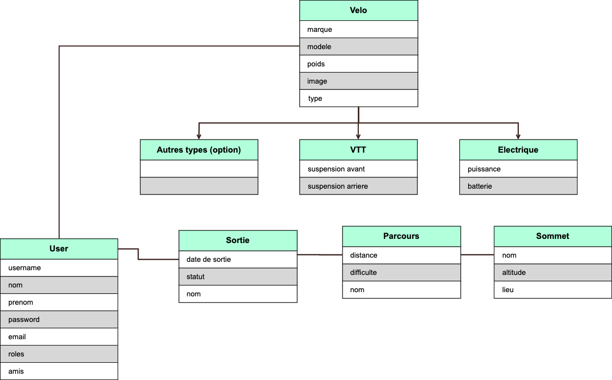

# LPDIM Bike App

Cette application a été développée dans le cadre de la licence DIM à l'IUT d'Annecy.

 

## Installation
L'application a été développée en Symfony version 5.
Après avoir cloner le projet vous pouvez lancé le mode développement via la cmd :

    $ symfony serve

Votre application sera disponible via l'url [http://localhost:8000](http://localhost:8000/)

Afin de pouvoir charger et compiler les assets (css, js, médias) vous devez également lancer, dans un 2ème terminal, la cmd :

    $ npm run watch
 

## L'application
Le projet consiste en une plateforme/application qui permettra à l’utilisateur de rentrer les données provenant de ses sorties à vélo et ainsi avoir un historique de celles-ci. 

L’utilisateur devra être inscrit sur la plateforme et il devra ajouter au moins un ou plusieurs vélo(s).
Il y a une entité mère vélo et chaque vélo pourra être de type VTT ou Route ou Electrique ou autre. Ces différents types de vélos héritent de l'entité vélo

L’utilisateur pourra créer des sorties liées à des parcours.
Chaque parcours pourra avoir un ou plusieurs sommets avec une altitude, une distance et une difficulté.
Chaque parcours sera obligatoirement public afin que chaque utilisateur puisse l’associer à une sortie.

Les sorties pourront avoir le statut de programmées ou réalisées.
Les utilisateurs pourront rajouter des amis avec lesquels ils pourront programmer des sorties ou simplement regarder ce que leurs amis ont réalisés comme parcours.

Un ou plusieurs utilisateurs auront le rôle d’administrateur et auront accès en modifications à toutes les données de la plateforme ainsi que l’accès au back-office.

L'application sera bientôt disponible en démo [ici](https://bike.glaudaflorent.fr/)

 

## Les entités
Ci-dessous le diagrammes qui nous à permis de définir la structure du projet :

